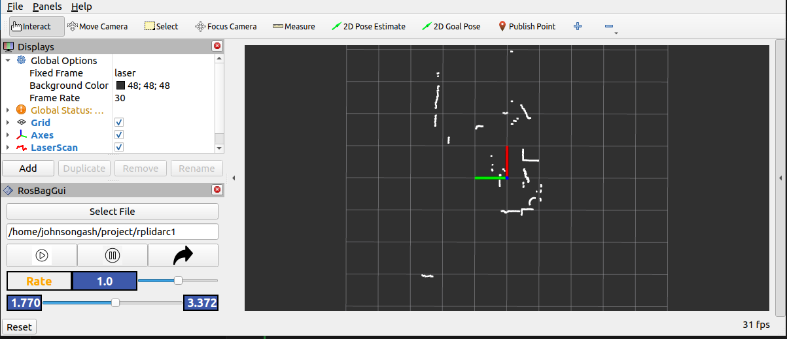

# rviz_panel_gui
Rviz panel gui for bag control, currently support arm64 and will add x86 soon.



## Environment Setup & Build Results
### Environment
- OS: Ubuntu 22.04
- Dependencies:
  - ROS2 Iron

### Build Results
| Step   | Status   |
| ------ | -------- | 
| arm64  | ✅ Success | 

### Usage Example
# clone and build
```
mkdir -p ~/ros2_ws/src
cd ~/ros2_ws/src
git clone https://github.com/johnsongash-code/rviz_panel_gui.git
cd ..
colcon build
```
# run with ros2 launch
```
source install/setup.bash
ros2 launch rviz_panel_gui rosbag.launch.py
```
then select your ros bag and start playing.